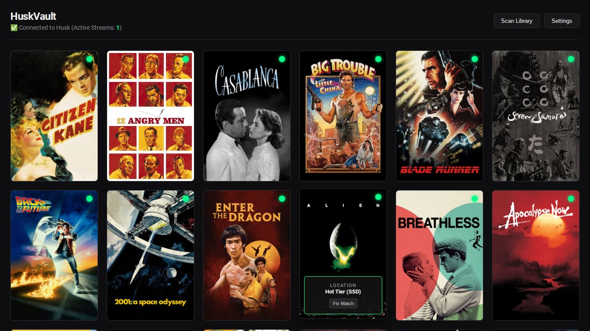

<div align="center">

# 🎬 HuskVault

### The Zero-Watt, Cold-Media Personal Cinema
**Permanent metadata. Instant streaming. Physical media shelf organization.**

[](LICENSE)
[](#prerequisites)
[](https://github.com/HuskHoard/HuskHoard)

<br/>



<br/>

[Overview](#-overview) • [Architecture](#-architecture) • [Quickstart](#-quickstart) • [Physical Media Workflow](#-physical-media-workflow) • [Configuration](#-configuration)

</div>

---

## 💡 Overview

**HuskVault** is a lightweight cinema frontend and metadata orchestrator designed specifically for cold-tier media archives. It connects directly with the [HuskHoard](https://github.com/HuskHoard/HuskHoard) kernel daemon to bring streaming-service aesthetics to physical storage media.

- **Permanent Metadata:** Movie posters, synopses, and file records remain cached on your fast NVMe drive—even when the underlying payload is shelved on cold media.
- **Zero Standby Power:** Archive drives, optical disc binders (BD-R/M-DISC), and LTO tapes draw 0W while idle on your shelf.
- **Physical Volume Prompts:** Clicking an unmounted movie shows you the exact binder slot, disc number, or volume UUID to insert.
- **StreamGate Direct Play:** Once mounted, media streams directly from the raw block device via HTTP 206 Byte-Range requests without unpacking or extracting gigabytes to SSD.
- **Built-in "Fix Match":** Override ambiguous titles with an interactive TMDb search directly inside the UI while preserving all physical shelf locations.

---

## ⚡ Architecture

HuskVault coordinates with HuskHoard's kernel block daemon:

```text
Browser Client (Desktop / TV / Tablet)
   │
   ├── [Port 5000: HuskVault Orchestrator]
   │     ├── index.html        (Responsive Poster Grid, Mount Modals, Settings)
   │     ├── server.py         (REST API: /api/scan, /api/status, /api/fix_match)
   │     ├── scraper.py        (Incremental TMDb + GuessIt Scraper)
   │     └── catalog.json      (Master index retaining tier and shelf placement)
   │
   └── [Port 8080: HuskHoard Kernel Daemon]
         ├── /api/dashboard    (Real-time volume states, UUID mapping, active streams)
         └── /stream/<file>    (HTTP 206 Byte-Range streaming from block storage)
```

---

## 🚀 Quickstart

### Prerequisites
- Modern Linux OS (Ubuntu 22.04/24.04, Debian 12, Arch)
- Python 3.10+
- A running [HuskHoard](https://github.com/HuskHoard/HuskHoard) daemon (default port `8080`)
- A free [TMDb API Key](https://www.themoviedb.org/settings/api)

### 1. Clone & Install Dependencies
```bash
git clone https://github.com/HuskHoard/HuskVault.git
cd HuskVault

# Install dependencies
pip install requests guessit
```

### 2. Launch the Server
```bash
python3 server.py
```
*HuskVault is now online at `http://localhost:5000` (or `http://YOUR_LAN_IP:5000`).*

### 3. Configure from the UI
1. Open the UI in your browser and click **Settings**.
2. Enter:
   - **TMDb API Key:** Your v3 auth key.
   - **Hot Tier Folder Path:** `/path/to/huskhoard/hot_tier`
   - **HuskHoard Daemon Endpoint:** `http://127.0.0.1:8080` (or LAN IP)
3. Click **Save Configuration**, then click **Scan Library**.

---

## 🗄️ Physical Media Workflow

HuskVault displays live badges based on volume telemetry:

| Badge | Status | Media Location | Playback Action |
|:---:|:---:|:---|:---|
| 🟢 | **RESIDENT** | Hot SSD Tier | Instant stream. |
| 🟢 | **ONLINE** | Nearline Drive / Mounted Disc | Wakes drive; streams immediately via StreamGate. |
| 🔴 | **OFFLINE** | Cold Shelf (BD-R / M-DISC / Tape) | Prompts: *"Please insert Binder A · Disc #12"*. |

### Fixing Ambiguous Titles ("Fix Match")
Hover over any card in the grid, click **Circle in upper left*, and search TMDb by title or enter a numeric TMDb ID. The poster and metadata update immediately while preserving all physical storage locations.

---

## 📦 Supported Archival Media

- **Optical Media (BD-R, BD-RE, M-DISC):** Burn archives as standard ISO or raw UDF volumes. Label your disc sleeves; HuskVault points you to the exact slot.
- **LTO Ultrium Tape:** Native compatibility with LTO-5 through LTO-9 formatted by HuskHoard.
- **Spun-Down External Hard Drives:** Keep USB drives in protective cases on your shelf. Plug them in only when watching the box set.

---

## 📄 License

- **HuskVault** is open-source software licensed under the [AGPL v3 License](LICENSE).
- Built to run alongside the [HuskHoard](https://github.com/HuskHoard/HuskHoard) storage tiering engine.
```
